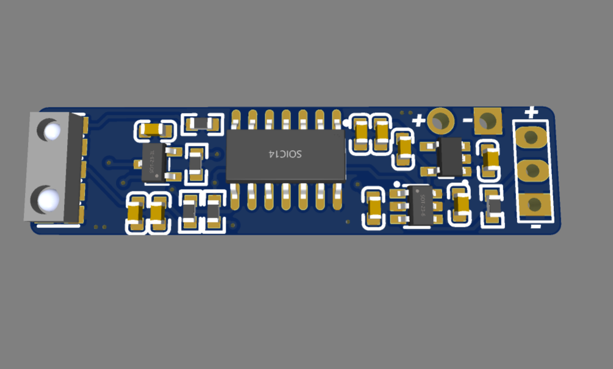
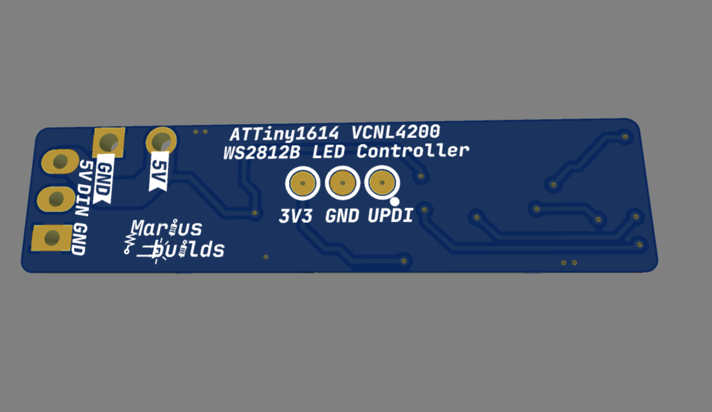

# WaveLight : ATtiny1614 + VCNL4200 WS2812B LED Controller

A tiny smart-lighting controller that turns a WS2812B LED strip **ON and OFF by itself**, based on how dark it is and whether someone is nearby. Wave your hand (or walk by), the lights come on. Walk away, they go off.

## How it works ?

The brain is an **ATtiny1614**, talking to a **VCNL4200** sensor that combines two senses in one tiny package:

- **Ambient light sensor (ALS)** – measures how bright the room is, so the lights don't turn on in broad daylight like a confused streetlamp.
- **Proximity sensor** – detects objects or movement within range, using its own IR LED.

The ATtiny reads both values in real time and decides when the WS2812B strip should be ON or OFF. Perfect for wardrobes, stairs, under-cabinet lighting, or any place where you're tired of looking for the light switch in the dark.

## MAIN FEATURES :

- **ATtiny1614** - small, cheap, and programmable over UPDI with just one data wire.
- **VCNL4200** ambient light + proximity sensor - two sensors for the price of one footprint.
- **SN74LVC1T45 level shifter** - turns the 3.3V data signal into a proper 5V one, so the WS2812B strip actually listens instead of just nodding politely.
- **AP2112K 3.3V LDO** - powers the logic and the sensor from the 5V supply.
- **P-MOSFET (SI2301)** on board for power switching.
- **Three sensor orientations** - the Gerber zip contains **three PCB versions**, each with the VCNL4200 rotated differently, so you can pick the one that fits your build.
- **Compact long-and-thin PCB** - easy to hide behind a shelf, inside a profile, or anywhere else nobody is supposed to look.

## Pinout 

| Pads | Function |
|---|---|
| **5V / GND** | Power input (5V) |
| **5V / DIN / GND** | Output to the WS2812B LED strip |
| **3V3 / GND / UPDI** | Programming header for a UPDI programmer |

## IMPORTANT INFORMATIONS ! 

1. **You need a UPDI programmer to upload the sketch.** The ATtiny1614 doesn't do USB, it only speaks UPDI. Any SerialUPDI programmer works, including [this one](https://github.com/mariusmym/Serial-UPDI-Programmer-USB-C-) (shameless self-promotion 😎).

2. **Use the 3V3 / GND / UPDI pads for programming.** Match the voltage on your programmer to the 3V3 pad, otherwise the board will get more voltage than it asked for.

3. **0603 components ahead.** The PCB is small, so some parts are 0603. The footprints are enlarged to allow hand soldering, *if you have the skills*. If you don't... this is a great project to acquire them (and a good tweezer).

4. **Pick the right PCB version before ordering.** Three designs, three sensor orientations, one wallet. Choose carefully.

5. **Size your power supply for the LED strip.** WS2812B LEDs can draw up to ~60mA each at full white, so the strip, not the ATtiny, decides how big your power supply needs to be.

## The example sketch 

The sketch in the **SKETCH** folder turns the board into a hands-free night light with a "touch" override:

- **Automatic mode** – when it's dark **and** something comes within range, the strip turns on (warm-ish white, nothing fancy) and switches itself off after **1 minute**. Like a fridge light, but for your hallway.
- **Touch override** – while the LEDs are on, bring your hand really close to the sensor (a few mm) and they turn off immediately. The board then enters **manual mode for 1 minute**: every close "touch" toggles the strip ON/OFF, and the automatic sensing is ignored. Perfect for when you want to walk past without the lights following you around like a puppy.
- After the minute is over, it goes back to automatic mode on its own.

### Settings you can tweak

All the "knobs" are at the top of the sketch:

| Setting | Default | What it does |
|---|---|---|
| `NUMLEDS` | 44 | Number of LEDs in your strip |
| `LED_PIN` | `PIN_PA7` | Data pin for the strip (leave it, it's wired on the PCB) |
| `PROXIMITY_THRESHOLD` | 30 | How close you need to be. Higher = closer (≈180 at 30cm, ≈40 at 60cm, ≈12 at 100cm) |
| `TOUCH_THRESHOLD` | 1000 | Value for a "touch" (a few mm from the sensor) |
| `AMBIENT_LIGHT_THRESHOLD` | 2 | How dark it must be. With the ceiling lights on it's 11000+, TV-only ≈13, minimum is 2 |
| `OVERRIDE_DURATION` | 60000 | Manual mode length, in ms |
| `timeoutDuration` | 60000 | How long the LEDs stay on in automatic mode, in ms |
| `brightness` | 100 | LED brightness (0–255) |

Pro tip: if your LEDs turn on while the room is still bright enough to read a book, raise `AMBIENT_LIGHT_THRESHOLD`. If they ignore you from across the room, raise... no wait, *lower* `PROXIMITY_THRESHOLD`. Proximity values go up as you get closer, because physics.

## Programming 

1. Install [megaTinyCore](https://github.com/SpenceKonde/megaTinyCore) by SpenceKonde in Arduino IDE. It already includes the `tinyNeoPixel_Static` library used by the sketch.
2. Install a VCNL4200 library that provides `Vishay_VCNL4200.h`.
3. Select **ATtiny3224/1624/1614/1604/824/814/804/424/414/404/214/204** under **Tools → Board**, then **Chip → ATtiny1614**.
4. Under **Tools → Programmer** choose a **SerialUPDI** option (230400 baud is a good start).
5. Connect the programmer to the **3V3 / GND / UPDI** pads, open the sketch from the **SKETCH** folder, set `NUMLEDS` for your strip, and use **Upload Using Programmer** (Ctrl+Shift+U).
If the strip lights up when you wave at it, congratulations: you've just built a very polite room.

## Main components 

| Part | Component | LCSC |
|---|---|---|
| MCU | ATTINY1614-SSNR | C481364 |
| Light & proximity sensor | VCNL4200 | C510773 |
| Level shifter | SN74LVC1T45DBVR | C7843 |
| LDO 3.3V | AP2112K-3.3TRG1 | C51118 |
| P-MOSFET | SI2301BDS-T1-GE3 | C558242 |

Full BOM in the **GERBER, BOM, PNP** folder.

## Repository content 

- **GERBER, BOM, PNP** – Gerbers for all **three** sensor orientations (and an extra ALL in ONE), plus BOM and pick-and-place files.
- **SCHEMATIC** – the schematic in PDF.
- **SKETCH** – the example Arduino sketch.
- **Images** – renders and photos.

## If you want to edit the PCB

**Project can also be found here:** https://oshwlab.com/mariusmym/PROJECT-LINK-HERE

## License 

The original design is licensed under CC BY-SA 4.0, so this remix is shared under [Creative Commons Attribution-ShareAlike 4.0 International](https://creativecommons.org/licenses/by-sa/4.0/).

- ✅ **Share** – copy and redistribute it in any medium or format
- ✅ **Adapt** – remix, transform, and build upon it, even commercially
- 🏷️ **Attribution** – give credit to wagiminator and to this remix
- 🔁 **ShareAlike** – if you remix it, share your version under the same license

## Donate ☕

If you'd like to say thanks or buy me a coffee, a **[PayPal donation](https://www.paypal.com/donate/?hosted_button_id=KHR7DYJP2Z8QJ)** is always appreciated!

Have fun and enjoy it ! 😊
